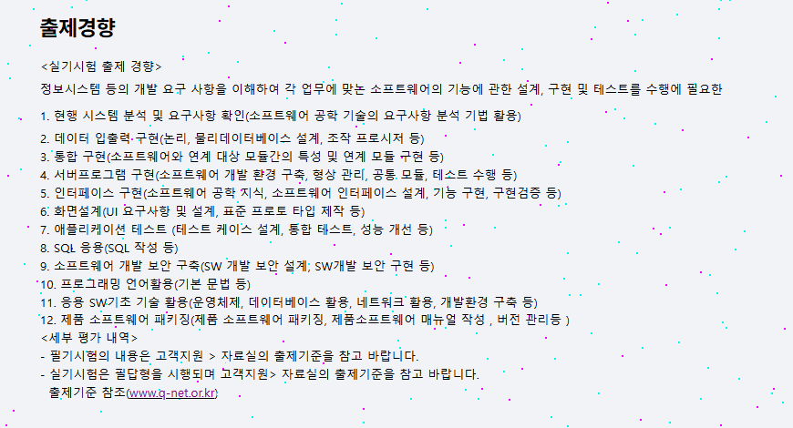

# 정보처리기사 실기

## 출제경향

- Q-net 에 접속하여 실기시험에 대한 정보를 찾아봤을때 실기의 출제경향은 총 12개의 흐름으로 보여진다.
    1. 현행 시스템 분석 및 요구사항 확인(소프트웨어 공학 기술의 요구사항 분석 기법 활용)
    2. 데이터 입출력 구현(논리, 물리데이터베이스 설계, 조작 프로시저 등)
    3. 통합 구현(소프트웨어와 연계 대상 모듈간의 특성 및 연계 모듈 구현 등)
    4. 서버프로그램 구현(소프트웨어 개발 환경 구축, 형상 관리, 공통 모듈, 테스트 수행 등)
    5. 인터페이스 구현(소프트웨어 공학 지식, 소프트웨어 인터페이스 설계, 기능 구현, 구현검증 등)
    6. 화면설계(UI 요구사항 및 설계, 표준 프로토 타입 제작 등)
    7. 애플리케이션 테스트 (테스트 케이스 설계, 통합 테스트, 성능 개선 등)
    8. SQL 응용(SQL 작성 등)
    9. 소프트웨어 개발 보안 구축(SW 개발 보안 설계, SW개발 보안 구현 등)
    10. 프로그래밍 언어활용(기본 문법 등)
    11. 응용 SW기초 기술 활용(운영체제, 데이터베이스 활용, 네트워크 활용, 개발환경 구축 등)
    12. 제품 소프트웨어 패키징(제품 소프트웨어 패키징, 제품소프트웨어 매뉴얼 작성 , 버전 관리등 )

## 카테고리 분류 
 - 이러한 값들은 흐름 없이 기능적인 순서로 배치되어 있다. 하지만 이를 빠르게 이해하기 위해서 카테고리를 분류하여 배치한 뒤 그에 따라 공부한다. 

카테고리의 기본 틀 
 ``` 
   요구사항 분석 - 소프트웨어 설계 - 구현 - 테스트 - 베포 
```


위의 흐름에 따라서 12개의 출제경향을 분류한다. 

### 요구사항 분석
 **1**. 현행 시스템 분석 및 요구사항 확인(요구사항 분석 기법 활용)

### 설계 
 **2**. 데이터입출력 구현 - 논리/물리 데이터베이스 설계, 데이터 조작 프로시저 

 **6**. 화면 설계 - UI요구사항 분석, 설계, 표준 프로토타입 제작 등

 ### 구현
 **3**. 통합구현 - 소프트웨어 모듈 간 연계, 연계 모듈 구현

 **4**. 서버 프로그램 구현 - 개발 환경 구축, 형상 관리, 공통 모듈 개발, 단위 
 테스트 수행
 **5**. 인터페이스 구현 - 인터페이스 설계, 기능 구현, 구현 검증

 **8**. SQL 응용 - SQL작성 및 응용 

 **10**. 프로그래밍 언어 활용 - 기본 문법 및 구현 기술 활용 

 **11.** 응용 SW기초 기술 활용 - OS, DB, 네트워크, 개발환경 활용 

**9.** 소프트 웨어 개발 보안 구축 - 보안요구사항 정의, 보안 아키텍처 설계, 보안코딩, 모듈구현 등

 ### 테스트 
 **7.** 애플리케이션 테스트 - 테스트케이스 설계, 통합테스트, 성능개선

 ### 베포 
 **12.** 제품 소프트웨어 패키징 - 패키징, 메뉴얼 작성, 버전관리 등
 